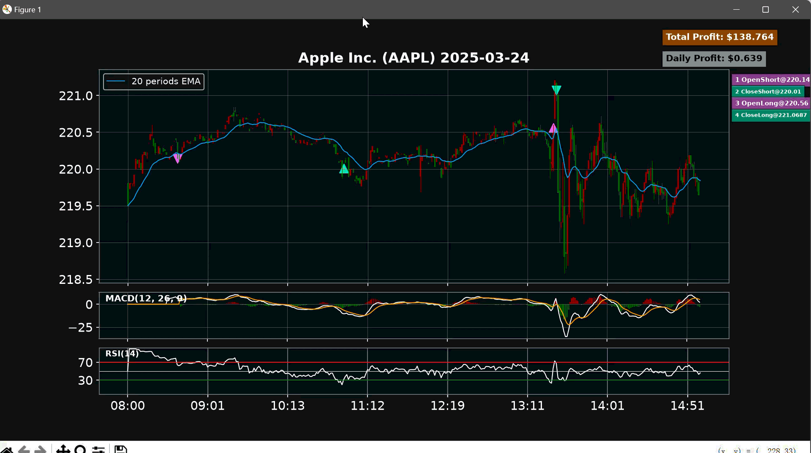

# Python For Finance

## Part1 数据获取与可视化

### 1.1 数据获取 

**BeautifulSoup**

通过 `requests + BeautifulSoup4` 公网 HTTP 请求，解析 Yahoo Finance 获取股票数据

**Selenium**

使用 `Selenium` 结合`xpath`解析页面内容获取数据

**API**

国内：[AKShare](https://akshare.akfamily.xyz/)、[Baostock](https://baostock.com/)、[AllTick](https://alltick.io/zh-CN)

国外：
    [Massive (原Polygon)](https://massive.com/)、[Finhub](https://finnhub.io/)、[Twelve Data](https://twelvedata.com/)

**官方来源**

国内A股正规行情请使用 Level 1 / Level 2 获取，请参考上海证券交易所[Level-1](./docs/Level-1%20产品说明书.pdf)和[Level-2](./docs/Level-2%20产品说明书.pdf)的产品说明书。

**模拟**

提供脚本模拟tick级别数据变化。

``` bash
python part1/RT_simulate_stock_data.py --nums 7 --interval 1 --rows 1000
```

参数：

--nums: 模拟的股票数量 

--interval：股价采样频率

--rows：新增条目数量


### 1.2 可视化
可视化界面显示股票每分钟K线、分钟交易量、RSI等信息。

``` bash
python part1/basic_realtime_panel.py
```


## Part2 量化策略与回测

### 2.1 量化策略

所有策略均支持**多空双向**操作，输出开多(*OpenLong*)、平多(*CloseLong*)、开空(*OpenShort*)、平空(*CloseShort*)四个操作。

- MA Crossover Strategy
- MACD Crossover Strategy
- RSI Crossover Strategy
- BB Bounce Strategy

### 2.2 回测平台

回测数据来源[Massive](https://massive.com/)平台，测试在`AAPL`上的效果，时间范围在2024/07/01至2026/07/01之间，数据存储于[AAPL_2024-07-01_to_2026-07-01.csv](AAPL\AAPL_2024-07-01_to_2026-07-01.csv)，共367,813条有效记录。

    注意：运行回测前需要进行数据清洗，主要过滤非交易时间段内的交易记录。请先运行 `python part2/data_parse.py` 得到清洗后完整数据。


在回测平台当中回测股票的每日操作情况，箭头标注操作时刻，记录每天的策略收益。

``` bash
python part2/backtest_panel.py
```




## Part3 实时交易